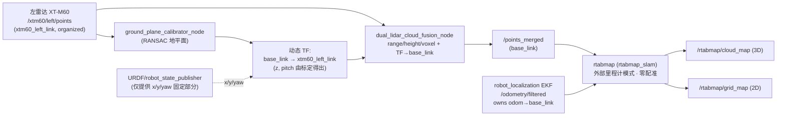

# Design Document

## Overview

本设计实现 `requirements.md` 定义的 **「纯 EKF 位姿、关闭 ICP」单雷达建图** 特性。核心是在不替换 RTAB-Map 的前提下,
把它从「ICP 辅助、硬件主导」彻底改为「**EKF 位姿逐字采信、零几何配准**」,并新增一个**地平面自动标定节点**
让雷达高度/俯仰从点云自动得出(雷达随时可移,不再手填外参),再修复审查报告中影响单雷达建图质量的几个缺陷
(D034/D168、D178、D179)。

关键认知(已在硬件上验证,本设计据此):

- XT-M60 是 120°×60° 窄视场 flash ToF。窄视场 ICP 在面对平墙时沿墙方向无约束、会滑移/旋转 yaw,把平行边
  拧成三角形(Triangle_Distortion)。**ICP 在本传感器上是负作用,必须关闭。**
- EKF(`/odometry/filtered`,H30 IMU 主导航向 + 轮速提供平移)已验证良好(90° 转向 EKF==IMU,直线误差 0.2%),
  作为**唯一位姿源**。
- 现状 `manual_mapping_left.launch.py` 虽已用 `odom_mode=external` 消费 `/odometry/filtered`,但 RTAB-Map 仍开着
  `Reg/Strategy=1`(ICP)+ `RGBD/NeighborLinkRefining=true` + `RGBD/ProximityBySpace=true`,**这些都会用 ICP 反过来
  改写 EKF 位姿**。本特性的关键就是把这三者全部关掉。

需求可追溯性见本文末 §Traceability。

## Architecture

### 数据流



要点:

1. **位姿链**:EKF 拥有 `odom→base_link`。RTAB-Map 工作于 `odom_mode=external`,**不启动 `icp_odometry`**(无 TF 争用)。
2. **几何链**:左雷达点云 → 地平面标定得到 `z/pitch` → 动态 TF → 融合节点把云变换到 `base_link` 并裁剪/降采样 → `/points_merged`。
3. **建图链**:RTAB-Map 把 `/points_merged` 按 EKF 位姿**直接堆叠**进数据库,产出 3D `cloud_map` 与投影 2D `grid_map`,
   不做任何会移动位姿的配准。
4. 单雷达:右雷达不要求在线;融合节点 `allow_single_lidar_fallback=true` 时仅左雷达新鲜也持续发布。

### TF 所有权(关键冲突点)

URDF 当前用固定 joint 提供完整的 `base_link→xtm60_left_link`(含已修正的 rpy=(1.5708,0,1.5708) 与占位 z=0.45)。
地平面标定要动态修正 `z` 与 `pitch`,若两者都发布同一条 TF 边会冲突。解决方案(本设计采用 **方案 A**):

- **方案 A(推荐)**:把 URDF 中 `xtm60_left_link` 的固定 joint **降级为只提供 x/y 与航向约定旋转(yaw 部分)**,
  由 `ground_plane_calibrator_node` 以 `tf2_ros.StaticTransformBroadcaster`(标定完成后发布一次,周期重标定时刷新)
  发布**完整的** `base_link→xtm60_left_link`(含标定出的 z 与 pitch)。为避免双发布,URDF 不再声明该 fixed joint
  (或保留但默认不由 robot_state_publisher 发布该边)。标定节点是该 TF 边的唯一所有者。
- **方案 B(备选)**:标定节点发布一个新帧 `xtm60_left_calibrated`,融合节点订阅该帧而非 `xtm60_left_link`。
  保留 URDF 原边但建图链不用它。改动更隔离,代价是多一个帧、配置稍绕。

采用方案 A:语义最干净(雷达帧只有一个真值源 = 标定节点),且直接满足需求 2.7(不依赖手填高度/俯仰)。
失败兜底(地面不可见)时标定节点持有上次有效变换继续发布,不会让 TF 边消失。

## Components and Interfaces

### 1. RTAB-Map(修改既有 `rtabmap_3d_mapping.launch.py` + `rtabmap_params.yaml`)

| 项 | 内容 |
|----|------|
| 角色 | 纯外部里程计建图,零几何配准 |
| 输入 | `scan_cloud`=`/points_merged`(BEST_EFFORT),`odom`=`/odometry/filtered`(external) |
| 输出 | `/rtabmap/cloud_map`(3D)、`/rtabmap/grid_map`(2D 投影)、`/rtabmap/mapData` |
| 帧 | `frame_id=base_link`,`odom_frame_id=odom`(EKF 拥有) |
| 不启动 | `icp_odometry` 节点(external 模式下本就不启动) |

### 2. ground_plane_calibrator_node(新增,`wheelchair_3d_mapping` 包)

| 项 | 内容 |
|----|------|
| 订阅 | `/xtm60/left/points`(`xtm60_left_link` 帧,organized XYZI) |
| 发布 | TF `base_link→xtm60_left_link`(StaticTransformBroadcaster);`/calibration/ground_plane`(`std_msgs/String` JSON,含 height/pitch/inlier_ratio) |
| 参数 | `input_topic`(默认 `/xtm60/left/points`)、`target_frame`(`base_link`)、`radar_frame`(`xtm60_left_link`)、`x_offset`/`y_offset`/`yaw`(URDF 几何里来的固定部分)、`ransac_distance_thresh`(0.03 m)、`ransac_iterations`(100)、`min_inlier_ratio`(0.15)、`vertical_normal_tol_deg`(25)、`recalibrate_period_sec`(0=仅启动一次)、`settle_frames`(累计多少帧后才锁定) |
| 依赖 | 仅 numpy(不引入 open3d,与 `cloud_utils` 一致,避免新依赖) |

### 3. dual_lidar_cloud_fusion_node(修改既有,审查修复 D034/D168、D178、D179)

| 项 | 内容 |
|----|------|
| 订阅 | `/xtm60/left/points`(+ 右雷达,单雷达阶段可缺) |
| 发布 | `/points_merged`(base_link)、`/points_merged/status` |
| 修改点 | 见 §Audit-fix design |

## Data Models

### PlaneFitResult(标定节点内部)

```
PlaneFitResult:
  normal: np.ndarray(3,)      # 单位法向量(传感器系)
  d: float                    # 平面方程 n·p + d = 0 的 d
  height: float               # 雷达原点到平面的垂距 = |d| (n 已归一化)
  pitch_rad: float            # 平面法向量与传感器竖直轴的夹角
  inlier_ratio: float         # 内点占比 ∈ [0,1]
  valid: bool                 # inlier_ratio ≥ min_inlier_ratio 且法向量近竖直
```

### CalibrationTransform(发布的 TF)

```
base_link → xtm60_left_link:
  translation: (x_offset, y_offset, height)         # x/y 来自参数, z=标定 height
  rotation: yaw(参数) ⊕ pitch(标定) ⊕ roll(0)        # 含已验证的 z前/y上/x左 约定旋转 + 标定 pitch
```

## “纯 EKF 位姿”机制决策(方案 A vs B)

- **方案 A(推荐,本设计采用)**:RTAB-Map external-odom + **几何配准完全关闭**。
  保留 `Mem/IncrementalMemory=true` 以维持数据库、`cloud_map`、`grid_map` 投影与未来视觉回环能力(满足需求 1.9)。
  新增代码最少:只改参数,不写新建图器。
- **方案 B(备选)**:用 `cloud_to_occupancy_grid_node` 或一个 pose-known 累积器,按 EKF 驱动的 TF 把每帧 `/points_merged`
  变换到固定帧累积。更简单但丢失 RTAB-Map 的数据库管理/导出。作为 A 不可用时的降级路径记录。

### RTAB-Map 参数变更表(方案 A)

> 注意:`rtabmap_3d_mapping.launch.py` 的注释指出 YAML 文件参数在本配置下不可靠,真正生效的是 launch 里硬编码的
> `essential` dict。因此**下列每一项必须同时改 `rtabmap_params.yaml` 与 launch 的 `essential` dict 两处**
> (这正对应审查 D041「双真值源」,本特性顺带消除该隐患:改后在 yaml 注释标注「dict 为准」)。

| 参数 | 现值 | 新值 | 原因 |
|------|------|------|------|
| `Reg/Strategy` | `1`(ICP) | `0` | 关闭配准,位姿不被 ICP 改写(req 1.2/1.3) |
| `RGBD/NeighborLinkRefining` | `true` | `false` | 关闭相邻关键帧 ICP 精修(否则仍改写 EKF 位姿) |
| `RGBD/ProximityBySpace` | `true` | `false` | 空间邻近回环也用 ICP 移动位姿,关闭 |
| `RGBD/ProximityPathMaxNeighbors` | `10` | `0` | 与上一致,禁用邻近搜索 |
| `Icp/*`(VoxelSize/Iterations 等) | 多项 | 保留但不生效 | Strategy=0 后 ICP 不被调用;保留以便回退,加注释 |
| `Reg/Force3DoF` | `true` | `true`(保留) | 平面轮椅,锁 z/roll/pitch 防地图倾斜;与零配准不冲突 |
| `Mem/IncrementalMemory` | `true` | `true`(保留) | 维持 DB/cloud_map/grid_map(req 1.9) |
| `Grid/*`(投影/法向量分割) | 多项 | 保留 | 2D 投影逻辑与配准无关,继续产 grid_map(req 1.5) |

`icp_odometry` 节点:external 模式下不启动(现状已是),无需额外改动;确认 `manual_mapping_left` 始终传
`odom_mode=external` + `odom_topic=/odometry/filtered`。

## Audit-fix design

> 文件:`src/wheelchair_3d_mapping/wheelchair_3d_mapping/dual_lidar_cloud_fusion_node.py`
> 与 `.../cloud_utils.py`。ICP 关闭后这些时间戳/TF 缺陷对配准的影响下降,但仍影响位姿插值时刻与几何正确性,故修。

### D034 / D168(高 → 关 ICP 后降级验证):`/points_merged` 用墙钟戳

- **现状**:`_publish_merged` 用 `header.stamp = self.get_clock().now().to_msg()`,丢弃源帧采集时刻。
- **改为**:用参与合并的源帧 `state.stamp`(取左/右中较新者,单雷达即左帧 stamp)作为输出 `header.stamp`;
  仅当源 stamp 全为 0(sec 与 nanosec 都为 0)时回退墙钟。`_LidarState.stamp` 已保存,直接使用。

### D178(中):融合 TF 用 latest 而非源时刻

- **现状**:`_lookup` 用 `rclpy.time.Time()`(最新可用变换),运动时用「最新 TF」变换「旧点云」产生与速度成正比错位。
- **改为**:`_lookup(source_frame, stamp)` 用 `msg.header.stamp` 查 TF(`lookup_transform(target, source, stamp, timeout)`);
  查不到(`ExtrapolationException` 等)时**跳过该帧**(返回 None,`_on_cloud` 已有 None 跳帧逻辑),不退回 latest 强变换。
- **注意**:标定节点用 StaticTransformBroadcaster 发布雷达 TF(static,任意时刻可查),故按源时刻查询不会因 static TF 失败;
  此修复主要保护 `odom→base_link` 等动态边的时刻一致性。

### D179(低):无效/占位点未显式剔除

- **现状**:依赖 `filter_by_range` 的 `min_range` 副作用滤掉 (0,0,0) 占位点,脆弱(min_range=0 时穿透)。
- **改为**:`filter_by_range` 在范数计算后显式加 `(r > 0)` 与 `np.isfinite` 全分量校验;或在 `read_xyz_intensity` 后
  显式剔除全零行。保留 `min_range` 语义不变。

每项修复在代码注释标注 `# audit Dxxx (severity)`(req 3.5)。

## Ground-plane calibration algorithm

输入:一帧(或 `settle_frames` 帧累计)`/xtm60/left/points`,在 `xtm60_left_link` 传感器系。已验证传感器系为
z 前、y 上、x 左 —— 故**地面的法向量在传感器系应接近 +y/−y 方向**(竖直轴是 y)。

步骤(numpy RANSAC):

1. 读点云,去 NaN,得到 `P (N,3)`。
2. RANSAC 迭代 `ransac_iterations` 次:随机取 3 点拟合平面 `n·p + d = 0`(n 归一化),统计 `|n·p + d| < ransac_distance_thresh` 的内点数。
3. 取内点最多的平面;对其内点做最小二乘精修(PCA 取最小特征向量为法向)。
4. **地面判定**:法向量与传感器竖直轴(y)夹角 < `vertical_normal_tol_deg` 才算地面;否则视为失败。
5. **高度**:`height = |d|`(n 归一化后,原点到平面垂距)。
6. **俯仰**:`pitch = ` 平面法向量偏离「理想竖直」的角度(绕传感器 x 轴分量),换算到 `base_link` 的 pitch 修正量。
7. **内点率**:`inlier_ratio = inliers / N`,< `min_inlier_ratio` 判失败。
8. 成功 → 组装 `base_link→xtm60_left_link` 变换(x/y/yaw 来自参数,z=height,叠加 pitch),StaticTransformBroadcaster 发布;
   失败 → 保留上次有效变换并节流告警(req 2.5)。
9. 把 height/pitch/inlier_ratio 以 JSON 发布到 `/calibration/ground_plane`,供 auto_test 记录(req 2.6)。

运行模式:`recalibrate_period_sec=0` 时仅启动后用前 `settle_frames` 帧标定一次并锁定;>0 时按周期重估(轮椅静止时最可靠)。

## Error Handling

- **EKF 位姿缺失 > 0.5s**:RTAB-Map external 模式下无新 odom 即不更新位姿;融合层与建图层均不应用过期位姿堆点
  (req 1.8)。在 auto_test 报告记录该情形。
- **地面不可见 / 内点率低**:标定节点保留上次有效 TF + 节流告警(req 2.5),绝不发布无效外参。
- **TF 查不到(按源时刻)**:融合节点跳过该帧(D178),不退回 latest。
- **单雷达缺右雷达**:`allow_single_lidar_fallback=true` 持续从左雷达发布(req 3.3 / req 4.2)。
- **源 stamp 全 0**:输出戳回退墙钟(D034/D168 兜底)。

## Testing Strategy

全程用 `auto_test/` 框架(req 5):每次测试建 `auto_test/<YYYYMMDD_HHMMSS>_<主题>/`,写 `report.md`
(现象 / 期望 / 初步根因→文件·参数·节点 / 建议修复 / 复现命令),复用 `auto_test/templates/report_template.md`。

关键验收测试:

1. **桌子小回环平行边检查(req 1.7)**:遥控绕一张桌子走一个小回环,导出 `/rtabmap/cloud_map` 或看 RViz,
   测量本应平行的两条桌/墙边夹角,**应 ≤ 5°**(三角形失真消失)。截图 + 点云数据交叉印证。
2. **地平面标定数值核对(req 2.6)**:读 `/calibration/ground_plane`,人工量一次实际高度对比,误差应在数 cm 内;
   移动雷达后重启,确认无需改 URDF 即自动更新。
3. **审查修复回归**:对比修复前后 `/points_merged` 的 `header.stamp` 来源(D034)、运动中 TF 时刻一致性(D178)、
   无效点剔除(D179),记录在报告。
4. **运动步骤高风险标注(req 5.4)**:任何 `motion_control_enabled:=true` 的步骤在报告标注离地/清场前置条件。

## Correctness Properties

> 这些是设计必须始终成立的不变式(invariants),用于指导验证与回归判断。

### Property 1: 位姿不被几何配准改写

在建图链路全程,RTAB-Map 输出的关键帧位姿与 EKF `/odometry/filtered` 在同一时刻的位姿一致(零配准 → 无 ICP
平移/旋转修正)。验证:对比 `/rtabmap/odom` 或 mapData 位姿与 EKF 位姿,差应仅为关键帧采样时刻差,不应出现 ICP 跳变。

**Validates: Requirements 1.2, 1.3, 1.7**

### Property 2: 单一 TF 所有权

`odom→base_link` 仅由 EKF 发布;`base_link→xtm60_left_link` 仅由 `ground_plane_calibrator_node` 发布;
`icp_odometry` 不启动。任意时刻无重复发布同一 TF 边。

**Validates: Requirements 1.2, 2.4, 2.7**

### Property 3: 外参自洽(地面 z≈0)

`/points_merged` 中地面点在 `base_link` 的 z 应集中在 0 附近(±标定误差),不出现整体抬高/下沉或水平面以下的
系统性假点(地平面标定正确的直接体现)。

**Validates: Requirements 2.2, 2.3, 2.4**

### Property 4: 时间戳单调可溯

`/points_merged.header.stamp` 等于其源帧采集时刻(D034/D168),非发布墙钟(除非源 stamp 全 0)。

**Validates: Requirements 3.1**

### Property 5: 失败安全

地面不可见或 TF 不可用时,系统保持上次有效外参 / 跳帧,绝不发布无效外参或用最新 TF 强变换历史点云。

**Validates: Requirements 1.8, 2.5, 3.2**

### Property 6: 单雷达可用性

右雷达缺席时建图链路仍持续产出 `/points_merged` 与地图(fallback)。

**Validates: Requirements 3.3, 4.1, 4.2**

## Phasing

- **阶段 1(本特性,必须成功)**:单左雷达(192.168.0.101)纯 EKF 位姿建图 + 自动地平面标定 + 相关审查修复。
- **阶段 2(后续,范围外)**:双雷达(右 192.168.1.101)——左右时间同步(D035)、右雷达外参(D133/D165)等推迟至此。

## Traceability

| 设计章节 | 满足的需求 |
|----------|-----------|
| Architecture / RTAB-Map 参数变更表 | 需求 1.1–1.6, 1.9 |
| Error Handling(EKF 缺失) | 需求 1.8 |
| Testing Strategy 测试 1 | 需求 1.7 |
| ground_plane_calibrator_node / 标定算法 / TF 所有权 | 需求 2.1–2.7 |
| Audit-fix design(D034/D168、D178、D179) | 需求 3.1–3.2, 3.4–3.5 |
| 融合节点单雷达 fallback | 需求 3.3, 4.2 |
| Phasing | 需求 4.1–4.4 |
| Testing Strategy(auto_test 协议) | 需求 5.1–5.5 |
| 参数变更表注释「dict 为准」/ 严重度标注 / 本地提交 | 需求 6.1–6.4 |
