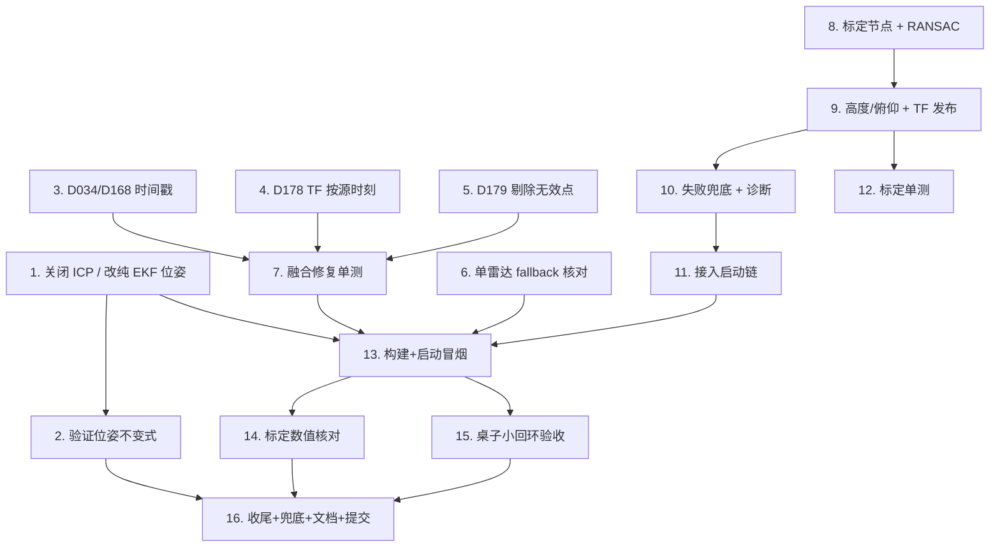

# Implementation Plan

## Overview

阶段 1:单(左)雷达纯 EKF 位姿建图 + 自动地平面标定 + 相关审查修复。所有改动仅本地提交、不推 GitHub;
每个验证任务用 `auto_test/` 框架(时间戳目录 + report.md)。任务顺序按依赖:先关 ICP(立即可见收益)→
再审查修复 → 再地平面标定 → 最后整链验证。

## Tasks

- [x] 1. 关闭 RTAB-Map 几何配准,改为纯 EKF 位姿建图(同步改 yaml 与 launch dict 两处真值源)
  - 修改 `src/wheelchair_3d_mapping/config/rtabmap_params.yaml` 的 `rtabmap:` 段:`Reg/Strategy` 1→0、
    `RGBD/NeighborLinkRefining` true→false、`RGBD/ProximityBySpace` true→false、`RGBD/ProximityPathMaxNeighbors` 10→0;
    保留 `Reg/Force3DoF=true`、`Mem/IncrementalMemory=true`、`Grid/*` 投影参数;`Icp/*` 保留并加注释「Strategy=0 后不生效,留作回退」。
  - 同步修改 `src/wheelchair_3d_mapping/launch/rtabmap_3d_mapping.launch.py` 里硬编码的 `essential` dict 同名键(这是实际生效源)。
  - 在 yaml 顶部注释标注「essential dict 为准」以消除审查 D041 双真值源隐患。
  - 确认 `manual_mapping_left.launch.py` 始终传 `odom_mode=external` + `odom_topic=/odometry/filtered`(现状已是,核对不改)。
  - _Requirements: 1.1, 1.2, 1.3, 1.9, 6.1_

- [x] 2. 验证关闭 ICP 后的位姿不变式(Property 1 / 2)
  - 用 `auto_test/` 建 `<时间戳>_disable_icp/` 目录,启动单左雷达建图链路,录制 `/odometry/filtered` 与 `/rtabmap/odom`。
  - 断言:RTAB-Map 关键帧位姿与 EKF 同时刻位姿一致(无 ICP 跳变);`icp_odometry` 未启动;`odom→base_link` 仅 EKF 发布。
  - report.md 写现象/期望/根因/复现命令,附 RViz 截图。
  - _Requirements: 1.2, 1.3, 5.1, 5.2, 5.3_

- [x] 3. 审查修复 D034/D168:`/points_merged` 用源帧采集时刻而非墙钟
  - 在 `dual_lidar_cloud_fusion_node.py` 的 `_publish_merged`:用参与合并源帧的 `state.stamp`(左/右取较新者,单雷达即左帧)
    作为输出 `header.stamp`;仅当源 stamp 全 0(sec 与 nanosec 均 0)时回退 `get_clock().now()`。
  - 加注释 `# audit D034/D168 (高; ICP 关闭后降级风险)`。
  - _Requirements: 3.1, 3.5_

- [x] 4. 审查修复 D178:融合 TF 按源时刻查询,查不到跳帧
  - 修改 `_lookup` 接受 `stamp` 参数,用 `msg.header.stamp` 调 `lookup_transform(target, source, stamp, timeout)`;
    `_on_cloud` 传入 `msg.header.stamp`。
  - TF 不可用(`ExtrapolationException` 等)时返回 None → 沿用既有「None 即跳帧」逻辑,不退回 `rclpy.time.Time()` 最新变换。
  - 加注释 `# audit D178 (中)`。
  - _Requirements: 3.2, 3.5_

- [x] 5. 审查修复 D179:显式剔除无效/占位点
  - 在 `cloud_utils.filter_by_range`(或 `read_xyz_intensity` 之后)显式加 `r > 0` 与全分量 `np.isfinite` 校验,
    剔除 (0,0,0)/NaN 点,不再依赖 `min_range` 副作用。
  - 加注释 `# audit D179 (低)`;保持 `min_range` 语义不变。
  - _Requirements: 3.4, 3.5_

- [x] 6. 确认并固化单雷达 fallback 行为
  - 核对 `dual_lidar_cloud_fusion_node` 在 `allow_single_lidar_fallback=true` 时仅左雷达新鲜即持续发布 `/points_merged`;
    确认 `manual_mapping_left.launch.py` 传 `allow_single_lidar_fallback=true` 且 `enable_xtm60_right=false`(现状核对)。
  - _Requirements: 3.3, 4.1, 4.2_

- [x] 7. 为融合节点审查修复补单元测试
  - 在 `src/wheelchair_3d_mapping/test/` 新增/扩展测试:构造带源 stamp 的 PointCloud2 验证输出 stamp 来源(D034);
    注入全 0 stamp 验证墙钟回退;构造含 (0,0,0)/NaN 点验证被剔除(D179);构造 `filter_by_range` 边界用例。
  - 运行 `colcon test --packages-select wheelchair_3d_mapping` 确认通过。
  - _Requirements: 3.1, 3.4_

- [x] 8. 新增 ground_plane_calibrator_node 骨架与 RANSAC 地平面拟合
  - 在 `src/wheelchair_3d_mapping/wheelchair_3d_mapping/ground_plane_calibrator_node.py` 新建节点,订阅 `/xtm60/left/points`。
  - 实现纯 numpy RANSAC:随机取 3 点拟合平面、按 `ransac_distance_thresh` 统计内点、取最优后 PCA 精修法向,产出 `PlaneFitResult`。
  - 地面判定:法向量与传感器竖直轴(传感器系 y)夹角 < `vertical_normal_tol_deg` 且 `inlier_ratio ≥ min_inlier_ratio`。
  - 在 `setup.py` 注册为 console_script entry_point。
  - _Requirements: 2.1_

- [x] 9. 实现高度/俯仰计算与 TF 发布(单一所有权)
  - 由 `PlaneFitResult` 计算:`height=|d|`(原点到地平面垂距),`pitch` = 法向偏离理想竖直的角度。
  - 用 `StaticTransformBroadcaster` 发布完整 `base_link→xtm60_left_link`:translation=(x_offset,y_offset,height),
    rotation = yaw(参数) ⊕ 已验证约定旋转 ⊕ pitch(标定)。
  - 从 URDF 移除/停止发布 `xtm60_left_fixed_joint` 这条边(`wheelchair.urdf.xacro`),使标定节点成为该 TF 唯一所有者,避免双发布。
  - 参数化:`x_offset`/`y_offset`/`yaw`/`radar_frame`/`target_frame`/`recalibrate_period_sec`/`settle_frames` 等。
  - _Requirements: 2.2, 2.3, 2.4, 2.7_

- [x] 10. 标定失败兜底与诊断输出
  - 地面不可见或 `inlier_ratio` 低于阈值:保留上次有效变换继续发布,节流告警,绝不发布无效外参。
  - 发布 `/calibration/ground_plane`(`std_msgs/String` JSON,含 height/pitch/inlier_ratio/valid)供 auto_test 记录。
  - 支持 `recalibrate_period_sec=0`(仅启动标定一次并锁定)与 >0(周期重估)两种模式。
  - _Requirements: 2.5, 2.6_

- [x] 11. 把标定节点接入单雷达建图启动链
  - 在建图启动路径(`manual_mapping_left.launch.py` 或其 fusion 子链)中启动 `ground_plane_calibrator_node`,
    确保它在融合节点消费 TF 之前就绪;确认融合节点 `target_frame=base_link` 经标定 TF 正确变换。
  - _Requirements: 2.4, 2.7, 1.6_

- [x] 12. 为地平面标定补单元测试
  - 在 `test/` 用合成点云(已知高度+倾角的平面 + 噪声/离群点)验证:RANSAC 估计的 height/pitch 在容差内、
    内点率计算正确、近竖直法向判定、低内点率时标记 invalid。
  - 运行 `colcon test --packages-select wheelchair_3d_mapping` 确认通过。
  - _Requirements: 2.1, 2.2, 2.3, 2.5_

- [x] 13. colcon 构建与启动冒烟测试
  - `colcon build --symlink-install --packages-select wheelchair_3d_mapping`(及受影响的 bringup),source 后启动单雷达
    建图链路,确认 `/points_merged`、`/rtabmap/cloud_map`、`/rtabmap/grid_map`、标定 TF 与 `/calibration/ground_plane` 均产出。
  - 用 `auto_test/` 记录启动日志与话题 `hz`,确认 `icp_odometry` 未启动、无 TF 冲突告警。
  - _Requirements: 1.4, 1.5, 1.6, 5.1, 5.2_

- [x] 14. 地平面标定数值核对(Property 3)
  - `auto_test/` 建 `<时间戳>_ground_calib/` 目录:读 `/calibration/ground_plane`,与人工实测雷达高度对比(误差应在数 cm 内);
    检查 `/points_merged` 中地面点在 base_link 的 z 集中在 0 附近、无水平面以下系统性假点。
  - 移动雷达高度后重启,确认无需改 URDF 即自动更新(req 2.7)。
  - _Requirements: 2.2, 2.3, 2.6, 2.7_

- [ ] 15. 桌子小回环平行边验收(Property 1 核心验收 · req 1.7)
  - `auto_test/` 建 `<时间戳>_table_loop_parallel/` 目录;`motion_control_enabled:=true` 步骤标注离地/清场前置条件(高风险)。
  - 遥控绕一张桌子走小回环,导出 `/rtabmap/cloud_map`,测量本应平行的两条桌/墙边夹角,断言 **≤ 5°**(三角形失真消失)。
  - report.md 附 RViz 截图 + 点云数据交叉印证,记录现象/期望/根因/复现命令;若仍 >5° 记录为窄视场无回环漂移(架构限制)留待后续。
  - _Requirements: 1.7, 5.1, 5.2, 5.3, 5.4_

- [ ] 16. 收尾:EKF 缺失兜底验证、文档与本地提交
  - 验证 `/odometry/filtered` 中断 >0.5s 时不用过期位姿堆点(req 1.8);在 report 记录已验证项与未能验证的安全相关项(req 6.3)。
  - 更新建图说明文档:单雷达为当前必须成功阶段、双雷达(D035/D133/D165)为后续阶段(req 4.3, 4.4);
    标注每项审查修复的 D 编号与严重度(req 6.1, 6.4)。
  - 所有改动仅本地提交,不推 GitHub(req 6.2)。
  - _Requirements: 1.8, 4.3, 4.4, 6.1, 6.2, 6.3, 6.4_

## Task Dependency Graph



```json
{
  "waves": [
    { "wave": 1, "tasks": ["1", "3", "4", "5", "6", "8"] },
    { "wave": 2, "tasks": ["2", "7", "9"] },
    { "wave": 3, "tasks": ["10", "12"] },
    { "wave": 4, "tasks": ["11"] },
    { "wave": 5, "tasks": ["13"] },
    { "wave": 6, "tasks": ["14", "15"] },
    { "wave": 7, "tasks": ["16"] }
  ]
}
```

## Notes

- 任务 1 是优先级最高、收益最直接的一步(关掉拖累建图的 ICP),建议先做并立即用任务 2 验证。
- 审查修复(3/4/5)彼此独立,可并行编辑同一融合节点文件后由任务 7 统一测试。
- 地平面标定链(8→9→10→11)是新增节点,任务 9 涉及从 URDF 移除雷达 fixed joint 边,改动 TF 所有权,需谨慎核对无双发布。
- 任务 15 是核心验收(平行边 ≤5°);若仍超差,记录为窄视场无回环的架构限制(需视觉回环),不在本阶段强行解决。
- 双雷达相关(D035/D133/D165)全部推迟到阶段 2,不在本计划内。
- 运动相关验证(任务 15)务必离地/清场,物理急停在手边。

