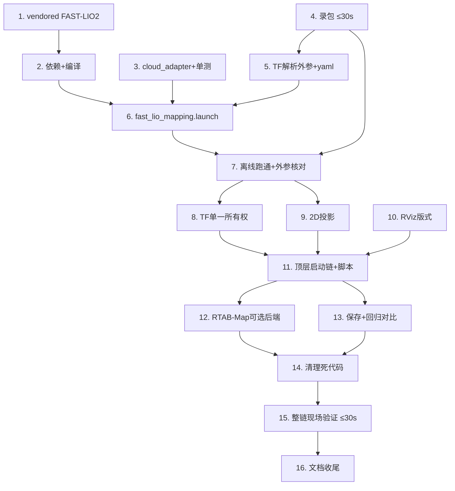

# Implementation Plan

## Overview

阶段:单(左)雷达 FAST-LIO2(LiDAR-惯性)建图替换纯 EKF/RTAB-Map 零配准链路(路线 2:RTAB-Map 降级为
可选回环后端)。所有改动仅本地;每个验证任务用 `auto_test/` 时间戳目录 + `report.md`。

**贯穿全程的硬约束**:
- **雷达过热**:任何上电 ≤ 30s 即停;优先「录一次包 → 离线反复复跑」,把上电次数降到最少;每次测试后 `pgrep` 确认无残留。
- **运动安全**:`motion_control_enabled` 默认 false;触发运动的步骤标注离地/清场,物理急停在手边。
- **顺序策略**:先把"录包"做掉(任务 4),之后绝大多数编译/调参都在离线 bag 上完成,无需再开雷达。

## Tasks

- [x] 1. 获取并 vendored FAST-LIO2(Humble fork),锁定 commit
  - 在 `src/third_party/` clone `https://github.com/Ericsii/FAST_LIO_ROS2.git --recursive`(含 `ikd-Tree` 子模块)。
  - 记录所用 commit hash 到 `docs/fastlio_mapping.md`(新建)与首个 auto_test 报告(req 1.5)。
  - 确认不引入 `livox_ros_driver2` 硬依赖:检查 FAST_LIO 的 CMake/package.xml 是否强依赖 livox 消息;
    若是,采用 Ericsii 的 standard-unit 方案或在 build 中绕过,并记录决策。
  - 不在本任务编译(留任务 2),仅落地源码 + 记录。
  - _Requirements: 1.1, 1.3, 1.5_

- [x] 2. 安装依赖并在 aarch64/Humble 编译 FAST-LIO2
  - 安装系统依赖:`libpcl-dev libeigen3-dev ros-humble-pcl-ros ros-humble-pcl-conversions`;`rosdep install --from-paths src --ignore-src -y`。
  - `colcon build --symlink-install --packages-up-to fast_lio`,确认 `BUILD_EXIT=0`。
  - 若缺 Sophus/TBB 等,补 apt 命令并记入 `docs/fastlio_mapping.md`(req 1.4)。
  - auto_test 记录:精确依赖命令、`colcon build` 输出、最终 commit hash。
  - _Requirements: 1.2, 1.4, 1.5_

- [x] 3. 实现 `lio_cloud_adapter_node`(XT-M60 → FAST-LIO 输入适配)+ 单元测试
  - 在 `wheelchair_3d_mapping/` 新建节点:订阅 `/xtm60/left/points`,复用 `cloud_utils` 剔除 NaN/(0,0,0),
    发布 `/lio/cloud_in`(XYZI,frame=`xtm60_left_link`)。
  - 参数:`input_topic`/`output_topic`/`restamp_to_now`(默认 false)/可选 `add_zero_time_field`(默认 false,
    仅当 FAST-LIO 严格要求 time 字段时启用)。
  - `setup.py` 注册 console_script。
  - 单元测试:无效点剔除、时间字段处理、restamp 逻辑;`colcon test --packages-select wheelchair_3d_mapping` 通过。
  - _Requirements: 2.1, 2.3, 2.5, 2.6_

- [x] 4. 录制离线 bag(一次上电 ≤30s)——后续所有离线工作的数据源
  - auto_test 建 `<时间戳>_lio_bag_capture/`;启最小左雷达驱动 + IMU(`sensors.launch.py` enable_xtm60_left + enable_imu,其余关)。
  - `ros2 bag record /xtm60/left/points /imu/data /tf /tf_static`;操作者手动慢速转一圈 + 走小回环;**≤30s 立即停雷达**。
  - 录完 `pgrep` 确认无残留;report 记录帧数、`/imu/data` 与点云 hz、bag 路径。
  - 该 bag 复制留存,作为任务 5–9、13 的唯一回放源(req 5.5, 6.2)。
  - **运动**:此步推/转轮椅,标注离地或清场、急停在手边(req 5.3)。
  - _Requirements: 5.1, 5.2, 5.5, 6.2_

- [x] 5. 从 TF 解析 LiDAR↔IMU 外参,生成 `xtm60_left_lio.yaml`
  - 写一次性工具:从 bag 的 `/tf_static` 解析 `T_il = inv(base→imu)·(base→lidar)`,得 `extrinsic_T`/`extrinsic_R`。
  - 创建 `wheelchair_3d_mapping/config/xtm60_left_lio.yaml`:`lid_topic=/lio/cloud_in`、`imu_topic=/imu/data`、
    通用 XYZI lidar_type、deskew off、`extrinsic_est_en=false`、室内 `filter_size_*`、`blind≈0.1`、注入外参。
  - 为外参解析工具补单元测试(已知 base→imu / base→lidar 合成 TF,断言 `T_il` 平移/旋转正确)。
  - auto_test 记录解析出的外参数值(req 3.1)。
  - _Requirements: 2.2, 2.4, 3.1_

- [x] 6. 创建 `fast_lio_mapping.launch.py`(adapter + fast_lio + 外参/参数注入)
  - 启动 `lio_cloud_adapter_node` + `fast_lio`(吃 `xtm60_left_lio.yaml`)。
  - 参数化 `tf_owner`(默认 lio)、`config_file`、`rviz`(默认 false,顶层另起)。
  - **帧名对齐(第二大坑)**:配置 FAST-LIO 的输出帧参数(默认 `camera_init`/`body`/`aft_mapped` 等内部命名)
    对齐到项目约定——`odom_frame=odom`、`body_frame=base_link`(具体参数名以 Ericsii fork config 为准),
    使 `/Odometry` 与 TF 直接落在项目 `odom`/`base_link` 上,避免后续到处补中间 TF。
  - _Requirements: 4.1, 2.1, 2.2, 3.1_

- [x] 7. 离线回放验证 LIO 跑通 + 外参核对(Property 4)
  - auto_test `<时间戳>_lio_offline_smoke/`:`ros2 bag play` 任务4的 bag,跑任务6的 launch(雷达 OFF)。
  - 断言:`/Odometry`、`/cloud_registered`、`/path` 有输出且 hz 合理;`odom→base_link` 由 fast_lio 发布。
  - **外参核对**:导出一帧 `/cloud_registered`,确认地面在 base_link 下 z≈0、墙面竖直;不对则修外参/传感器约定,迭代。
  - report 记录 hz、外参核对图/数据(Property 4)。
  - **GO/NO-GO 判定点(集成外部算法的正式关口)**:在离线 bag 上评估 FAST-LIO2 是否收敛/稳定
    (位姿不发散、`/cloud_registered` 结构合理、yaw 不漂)。
    - GO:继续任务 8+。
    - NO-GO(LIO 不收敛/在窄视场+无 time 字段下不稳):**停下评估备选**(调参、Point-LIO `dfloreaa/point_lio_ros2`、
      或回到设计重议),不带病硬推到现场上电。判定结论写入 report。
  - _Requirements: 2.2, 3.1, 3.4, 6.3_

- [x] 8. TF 单一所有权接入(tf_owner=lio,关闭 EKF/ZLAC 的 TF)
  - 改顶层启动链:`tf_owner=lio` 时 `manual_teleop.launch.py` 的 EKF `publish_tf:=false`、ZLAC `publish_tf:=false`;
    FAST-LIO2 为 `odom→base_link` 唯一发布者。EKF 仍运行算 `/odometry/filtered`(诊断/一致性),但不发 TF。
  - 提供 `map→odom` 的处理:RTAB-Map 关时用 identity static TF(让 Fixed Frame=map 可用)或文档说明用 odom。
  - 离线回放断言:无 `TF_REPEATED`/authority 冲突;`icp_odometry` 不启动(Property 3)。
  - _Requirements: 3.2, 3.3, 3.5_

- [x] 9. 2D 投影接入(`cloud_to_occupancy_grid_node` 吃 LIO 云)
  - 改 `cloud_to_occupancy_grid_node` 输入为 LIO 累积/配准云,输出 `/map_2d_from_3d`。
  - 离线回放断言 2D 栅格产出且与 3D 结构一致。
  - 若改动涉及投影逻辑,补/更新 `cloud_to_occupancy_grid` 相关单元测试,`colcon test` 通过。
  - _Requirements: 4.5_

- [x] 10. 新建 RViz 版式 `manual_mapping_lio_left.rviz`(req 8)
  - 显示项:Grid/TF/RobotModel;LIO 3D Cloud Map(AxisColor/Intensity,实时帧 Decay=0);2D Map(`/map_2d_from_3d`);
    LaserScan(`/scan`);LIO Odometry+Path;**4 路相机 Image**(`/camera/{front,left,right,rear}/image_raw`,缺失留空不破版);
    TeleopPanel;Battery(若有话题)。
  - 视图 Orbit + TopDownOrtho;Fixed Frame=map(或 odom)。布局对标参考截图(主3D + 底部2D/LaserScan + 侧栏相机)。
  - 离线回放 + 截图验证各面板齐全。
  - _Requirements: 8.1, 8.2, 8.3, 8.4, 8.5, 8.6, 8.7, 8.8, 8.9_

- [x] 11. 顶层启动链 `manual_mapping_lio_left.launch.py` + 改写 `run_rviz_manual_mapping_left.sh`
  - 新顶层 launch:manual_teleop 基座(EKF publish_tf=false)+ fast_lio_mapping + 可选 2D 投影 + RViz(新版式)。
  - 参数:`motion_control_enabled`(默认 false)、`radar:=left`、`enable_loop_backend`(默认 false)、`rviz`(默认 true)。
  - 改写 `scripts/run_rviz_manual_mapping_left.sh` 指向新 launch + 新 rviz;保留 X display 探测、pre-launch cleanup、cleanup trap。
  - **确认 `/scan` 仍可用**:核对 manual_teleop 基座仍启动 `pointcloud_to_laserscan_node` + `scan_merger_node`,
    使 `/scan` 在 LIO 链路下继续发布(RViz LaserScan 面板 req 8.3 与任务 9 依赖它);若基座不再起这些节点,
    在顶层 launch 显式补上或在文档标注 LaserScan 面板数据来源。
  - 更新 `scripts/stop_mapping.sh` 进程模式(加 `fast_lio`、`lio_cloud_adapter`;旧 rtabmap 模式保留兼容)。
  - _Requirements: 4.1, 4.7, 7.2, 8.3_

- [x] 12. RTAB-Map 降级为可选回环后端(req 10)
  - 改/包装 `rtabmap_3d_mapping.launch.py`:`enable_loop_backend:=true` 时以 external-odom(`odom_topic=/Odometry`、
    Reg/Strategy=0)消费 LIO 位姿,仅做回环/位姿图/导出;默认不启动。
  - 顶层 launch 接入该开关(默认 false)。
  - 离线/文档验证:默认关时仍出清晰 3D + 2D(Property 5);开时 RTAB-Map 起且不抢前端里程计。
  - _Requirements: 10.1, 10.2, 10.3, 10.4_

- [x] 13. 地图保存适配 + before/after 回归对比(req 11)
  - 改写 `scripts/save_mapping_result.sh`:保存 FAST-LIO 累积点云(PCD/PLY,经 `/map_save` 服务或订阅落盘)+
    2D 栅格(PGM+YAML);`enable_loop_backend` 时可选存 `.db`。
  - auto_test `<时间戳>_lio_vs_rtabmap_regression/`:同一 bag 分别跑「旧 RTAB-Map 零配准」与「FAST-LIO2」,
    量化对比墙厚度/平行边夹角/回原点闭合误差,附两图对照(Property 1/2,req 11.3)。
  - _Requirements: 11.1, 11.2, 11.3, 11.4_

- [x] 14. 清理遗留死代码(req 9)
  - 删除 KISS-ICP:`kiss_icp_mapping_node.py`、`kiss_icp_mapping.launch.py` 及 setup.py 注册、相关测试。
  - 删除/归档 `ground_plane_calibrator_node.py` 及其 launch 启动、`test_ground_plane_*`。
  - 移除/重构旧 LIVO 占位:`livo_3d_mapping.launch.py`、`livo_interface.yaml`(避免误导入口)。
  - 移除旧 `manual_mapping_left.launch.py` 的 RTAB-Map 零配准硬编码入口(由任务11新入口取代);旧 rviz 视情归档。
  - `colcon build` + `colcon test` 全绿(req 9.5)。
  - _Requirements: 9.1, 9.2, 9.3, 9.4, 9.5, 9.6_

- [ ] 15. 整链现场验证(一次上电 ≤30s)+ Property 1 核心验收
  - auto_test `<时间戳>_lio_live_mapping/`:真实左雷达跑完整 `manual_mapping_lio_left`(只读,MOTION=false 先验证链路),
    RViz 截图各面板;若需运动则离地/清场后短时遥控小回环,导出地图测平行边 ≤5°(Property 1)。
  - ≤30s 即停,`pgrep` 确认无残留。
  - report 现象/期望/根因/复现命令 + 截图 + 数据交叉印证;与旧漩涡图对照。
  - _Requirements: 4.2, 4.4, 4.6, 5.1, 5.2, 5.3, 6.1, 6.3, 6.4, 6.5_

- [x] 16. 文档彻底更新与收尾(req 7)
  - 新建 `docs/fastlio_mapping.md`:依赖安装、获取/编译 FAST-LIO2(URL+commit)、启动建图、录包、保存地图、外参核对、RTAB-Map 后端开关。
  - 更新顶层 `README` 与 `src/wheelchair_bringup/README.md`:建图主线=FAST-LIO2 单左雷达;标注双雷达/视觉(方案A)/轮速(方案C)为后续阶段。
  - 更新/弃用 `docs/rtabmap_3d_mapping.md` 等旧"主线=RTAB-Map"表述为"可选回环后端"。
  - 记录已知限制:窄视场沿墙平移退化、无回环(默认),后续方案 A/C 缓解(req 7.6)。
  - 改动保留本地;是否推 GitHub 由用户决定(req 7.5)。
  - _Requirements: 7.1, 7.2, 7.3, 7.4, 7.5, 7.6_

## Task Dependency Graph



```json
{
  "waves": [
    { "wave": 1, "tasks": ["1", "3", "4"] },
    { "wave": 2, "tasks": ["2", "5"] },
    { "wave": 3, "tasks": ["6"] },
    { "wave": 4, "tasks": ["7", "10"] },
    { "wave": 5, "tasks": ["8", "9"] },
    { "wave": 6, "tasks": ["11"] },
    { "wave": 7, "tasks": ["12", "13"] },
    { "wave": 8, "tasks": ["14"] },
    { "wave": 9, "tasks": ["15"] },
    { "wave": 10, "tasks": ["16"] }
  ]
}
```

## Notes

- 任务 4(录包)尽早做:它是唯一需要"运动 + 雷达上电"的采集步骤,之后 5–13 几乎全离线,极大减少雷达上电次数。
- 任务 6 的**帧名对齐**与任务 7 的**外参核对**是本计划两大技术风险点(传感器坐标约定 + FAST-LIO 内部帧命名),
  不通过则停下迭代,不要带病往下走。
- 任务 7 末尾设有 **GO/NO-GO 判定关口**:若 FAST-LIO2 在 XT-M60 窄视场 + 无 time 字段下离线不收敛,
  先停下评估备选(调参 / Point-LIO / 回设计),这是集成外部大算法的负责任做法。
- 任务 14(清理)放在功能跑通(11/12/13)之后,避免过早删代码导致回退困难。
- 任务 15 是唯一第二次必需的现场上电(整链确认),仍 ≤30s 即停;运动验收离地/清场。
- 双雷达 / 视觉融合(方案 A)/ 轮速约束(方案 C)均为后续阶段,不在本计划。
