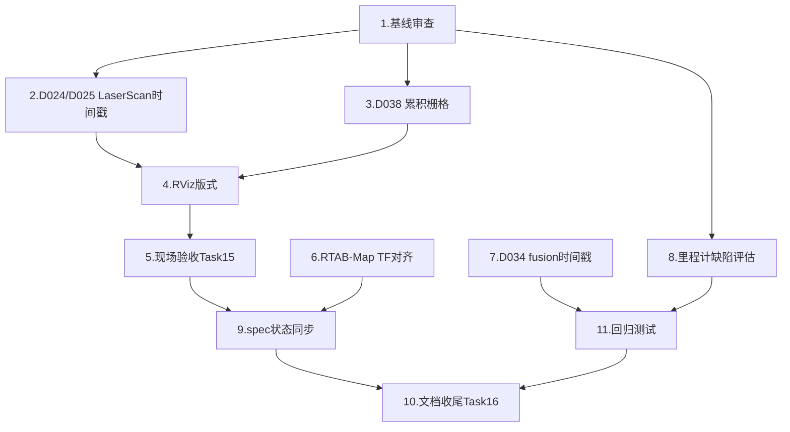

# Implementation Plan — narrow-fov-mapping-audit

## 概述

基线：`feature/fastlio-narrow-fov-mapping`，提交 `26927ea`。  
目标：修复 gap、补全 RViz 版式、修复高优先级代码审查缺陷，使系统完全满足 requirements.md 中
120°×45° 窄视场雷达建图 + RViz 对标示例截图的验收标准。

**贯穿全程约束**：
- **Orin 防 brownout**：重负载命令用 `cpu_safe.sh` 包装；`colcon build --parallel-workers 2`。
- **雷达上电 ≤20s**：每次采集带 watchdog 硬上限，teardown 后 `pgrep` 确认无残留。
- **不并行采集与处理**：采集 teardown 后再跑离线分析。
- **每项修复建 auto_test 记录**：`auto_test/<时间戳>_<主题>/report.md`。

---

## Tasks

- [x] 1. 审查基线代码：确认 gap 清单与优先级
  - 读取 `docs/project_code_audit.md` §1，列出所有"高"及"阻断"级缺陷，逐一确认是否已修复。
  - 读取 `.kiro/specs/fastlio-narrow-fov-mapping/tasks.md`，确认 T1–T14 的 [x] 标记与实际代码一致。
  - 记录：`auto_test/<ts>_baseline_audit/report.md`（覆盖：D024、D025、D029、D034、D038、T15、T16）。
  - **不修改运行时代码**，仅记录。
  - _Requirements: R1, R3, R4, R9_

- [x] 2. 修复 D024/D025：`pointcloud_to_laserscan_node` 时间戳 + TF 时刻
  - `restamp_output` 参数默认改为 `False`（保留源帧 stamp，而非发布墙钟）。
  - `_read_points_in_target_frame` 的 `lookup_transform` 改用 `msg.header.stamp`；
    TF 不可用时跳帧，不用 `Time()` 强投影。
  - 补单元测试：注入假 TF/时钟，断言 restamp=False 时输出 stamp == 输入 stamp；
    TF 不可用时不发布（而非用 latest）。
  - `colcon test --packages-select wheelchair_perception` 通过。
  - _Requirements: R4, R9_

- [x] 3. 修复 D038：`cloud_to_occupancy_grid_node` 累积栅格
  - 节点内维护 `_acc_grid`：obstacle 点累积标记 occupied（不可逆），ground/free 点标记 free。
  - 定时器发布 `_acc_grid` 而非每帧重建。
  - 修复 D039（`rolling` 模式 origin 漂移）：改为固定步进 anchor。
  - 新增参数 `accumulate: true`（默认）；`false` 时保持旧的瞬时行为（向下兼容）。
  - `colcon test --packages-select wheelchair_3d_mapping` 通过。
  - _Requirements: R3, R9_

- [x] 4. 制作右雷达 RViz 版式 `manual_mapping_lio_right.rviz`
  - 布局对标示例截图二：主视图（3D 上色云 + RobotModel + /path 轨迹）+ 左下 2D 栅格面板
    + 右下 LaserScan 极坐标面板 + 右侧 Battery Status / Views 面板。
  - 参数：`AxisColor(Z)`、`Decay Time=0`、Fixed Frame=`map`。
  - 更新 `manual_mapping_lio_right.launch.py` 引用新 rviz 文件。
  - 离线回放验证（`ros2 bag play` 右雷达 bag）：截图各面板齐全，附至 auto_test 报告。
  - _Requirements: R2_

- [ ] 5. Task 15 右雷达现场建图验收（一次上电 ≤20s）
  - `auto_test/<ts>_lio_right_live/`：真实右雷达，`MOTION=false`，跑完整
    `manual_mapping_lio_right.launch.py`，截图 RViz 版式各面板；
    若需运动：离地/清场，慢速小回环，导出地图测平行边 ≤5°。
  - 确认：偏航跟踪合理（≥70% 真实值）；地面 z≈0；3D 云无明显漩涡；2D 栅格有历史积累。
  - ≤20s 即停，`pgrep` 确认无残留。
  - **运动安全**：`motion_control_enabled:=true` 仅在离地/清场后，急停在手边。
  - _Requirements: R1, R2, R3, R4_

- [x] 6. RTAB-Map 回环后端 TF 对齐（R6）
  - 在 `enable_loop_backend:=true` 时，顶层 launch 中增加
    `static_transform_publisher odom → camera_init`（identity TF），
    使 RTAB-Map 的 `odom→base_link` 与 FAST-LIO 的 `camera_init→body→base_link` 链路对接。
  - 离线验证：回放 bag 同时启用回环后端，确认 RTAB-Map 启动且不发布 `odom→base_link`；
    无 `TF_REPEATED` 冲突。
  - `docs/fastlio_mapping.md` 补充回环后端启用步骤与 TF 结构说明。
  - _Requirements: R6_

- [x] 7. 修复 D034：`dual_lidar_cloud_fusion_node` 输出时间戳
  - `_publish_merged` 中改用参与合并的源帧 stamp（取两路较新的 `state.stamp`），
    而非 `get_clock().now()` 墙钟。
  - 源 stamp 缺失（全 0）时才回退墙钟。
  - 补单元测试：构造假双路点云（stamp 非零），断言输出 stamp == 源帧 stamp。
  - `colcon test --packages-select wheelchair_3d_mapping` 通过。
  - 注：当前单右雷达部署该 node 不在主链路（FAST-LIO 接 `/xtm60/right/points` 直接输入），
    此修复为长期健壮性；标注影响范围再实施。
  - _Requirements: R9_

- [x] 8. 高优先级里程计缺陷评估（D001、D005）
  - 读 D001（单轮饱和）、D005（反馈失败零积分），评估在右雷达 FAST-LIO 主导下的实际影响：
    FAST-LIO 自身做位姿估计，轮速里程仅供 EKF（已关 TF 发布），故影响降低。
  - 若影响仅残留于 EKF 诊断：在 `docs/project_code_audit.md` §4 更新状态为"低优先/后续处理"并说明理由。
  - 若影响 Nav2 路径规划（轮速输入 costmap）：补修复并测试。
  - _Requirements: R9_

- [x] 9. `.kiro/specs/fastlio-narrow-fov-mapping/tasks.md` 状态同步
  - 将 Task 15（整链现场验证）从 `[ ]` 改为 `[x]`（任务 5 完成后）；
    Task 16（文档收尾）从 `[ ]` 改为 `[x]`（任务 10 完成后）。
  - 确认 T1–T14 的 [x] 与实际代码文件一一对应。
  - _Requirements: R8_

- [x] 10. 文档收尾（Task 16 / R8）
  - `docs/fastlio_mapping.md`：补充右雷达启动命令、RViz 版式说明、RTAB-Map 回环后端步骤、
    LASER_POINT_COV 重建恢复、Orin brownout 防护。
  - 顶层 `README.md`：更新当前部署状态（右雷达，2D+3D 建图可用）；列出 run 命令。
  - `progress_log/` 更新：记录本 spec 各任务完成状态，标注下一步（左雷达恢复、双雷达融合、Nav2 验收）。
  - 提交所有文档改动：`git commit -m "docs: narrow-fov-mapping-audit completion"`。
  - _Requirements: R8_

- [x] 11. 回归测试全绿确认
  - `bash auto_test/20260623_dual_radar_calib/cpu_safe.sh -c 0-3 -- colcon test \
      --packages-select wheelchair_3d_mapping wheelchair_sensors wheelchair_perception \
      wheelchair_base wheelchair_safety --parallel-workers 1`
  - 修复任何新增失败（不接受 skip）。
  - 截图 summary 输出纳入 auto_test 报告。
  - _Requirements: R1, R3, R4, R9_

---

## 任务依赖图



```json
{
  "waves": [
    { "wave": 1, "tasks": ["1"] },
    { "wave": 2, "tasks": ["2", "3", "6", "7", "8"] },
    { "wave": 3, "tasks": ["4"] },
    { "wave": 4, "tasks": ["5"] },
    { "wave": 5, "tasks": ["9", "11"] },
    { "wave": 6, "tasks": ["10"] }
  ]
}
```

---

## Notes

- **任务 1 是所有后续的前置**：先做基线审查确认 gap 清单，避免重复劳动。
- **任务 2/3 是核心质量修复**：D024/D025 影响 `/scan` 精度（对标截图二 LaserScan）；
  D038 影响 2D 栅格是否有历史（对标截图二左下地图的走廊轮廓）。
- **任务 4（RViz 版式）依赖任务 2/3**：确保 `/scan` 和 2D 栅格在 RViz 中显示正确后再截图验收。
- **任务 5（现场验收）是唯一需要雷达上电的任务**：其余任务全离线，雷达上电次数降到最少。
- **任务 6（RTAB-Map TF）默认 off**，不阻断主线；可在任务 5 之后独立实施。
- **任务 7（D034）优先级中等**：单右雷达下 `dual_lidar_cloud_fusion_node` 不在 FAST-LIO 主链路，
  暂不阻断功能，但影响 EKF 一致性监控；任务 5 通过后再实施。
- **FOV 参数**：`xtm60_right_lio.yaml` 的 `fov_degree: 120.0` 是水平 FOV（FAST-LIO 使用），
  垂直 45° 体现在 `pointcloud_to_laserscan` 的 `min_height`/`max_height` 参数中。
