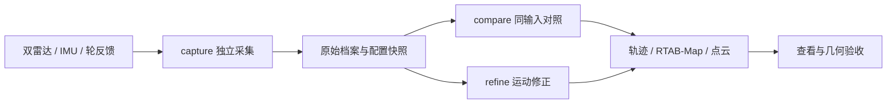

# SmartWheel · V7 双雷达采集与建图

面向 Jetson Orin 的轮椅传感器采集、手动驾驶与室内建图工程。支持双 XT-M60 雷达、H30 IMU 和轮反馈留存，再用同一份录包反复融合、比较估计器和检查地图；相机与超声波按采集配置选择。

本分支 `v7/orin-usb-20261006` 保存 V7 程序；名称沿用历史，**运行不要求 U 盘**。当前默认五状态平面 EKF，处于几何和动态验证阶段，尚未完成所有算法的最终选型。

## 导航

- [功能与流程](#功能与流程)
- [运行环境](#运行环境)
- [首次部署或重装](#首次部署或重装)
- [配置与数据目录](#配置与数据目录)
- [录制一次数据](#录制一次数据)
- [实时预览与建图](#实时预览与建图)
- [离线融合与算法对照](#离线融合与算法对照)
- [查看地图与左右点云](#查看地图与左右点云)
- [验证与维护](#验证与维护)
- [项目结构与文档](#项目结构与文档)

## 功能与流程

- 分左右雷达保存 raw/filtered 点云、帧身份、时间和配置；保存 IMU 原包、轮反馈事务及错误。
- 采集、处理分离：录制不启动 SLAM，离线融合不连接真实设备、不回放驾驶指令。
- 五状态 EKF 与 robot_localization 对照；零偏、轮速一致性、过程噪声、过滤与几何纠偏实验。
- RTAB-Map 地图导出、RViz 查看、左右点云网页配准；输入、参数、每帧来源和结果可追溯。



雷达 raw 是设备处理和 SDK 投影后、主机过滤前的点云，不是原始 UDP 网络包；相机 BGR 归档不是原始 UVC 字节。

## 运行环境

| 项目 | 当前实机基线或要求 |
|---|---|
| 系统 | Jetson Orin / aarch64，Ubuntu 22.04.5，Jetson Linux 36.4.4 |
| ROS / Python | ROS 2 Humble / Python 3.10 |
| 建图 / 官方 EKF | RTAB-Map 0.23.7 / robot_localization 3.5.4 |
| 原生依赖 | Qt5 / RViz、Boost、Eigen、OpenSSL、匹配的 OpenCV 4.5.4 与 legacy TBB |
| 当前安装约定 | 用户 nvidia，主机名 ubuntu，路径 /home/nvidia/wheelchair |
| 数据位置 | 工程之外的本机目录、内部 SSD 或显式配置的移动盘 |

部分入口仍校验用户、主机名和安装路径；这是已验证的部署约定，不是任意目录或系统版本的兼容声明。Windows 可编辑和备份代码，不能直接运行 Orin 硬件入口。

## 首次部署或重装

**configure_storage 只设置保存位置，不会安装依赖、恢复硬件绑定或编译程序。** 完整流程和逐步检查见 **[部署与重装指南](docs/deployment.md)**。

### 1. 获取程序

在符合上述约定的新 Orin 上、目标目录尚不存在时：

```bash
cd /home/nvidia
git clone --branch v7/orin-usb-20261006 --single-branch \
  https://github.com/owenkings/smartwheel.git wheelchair
cd /home/nvidia/wheelchair
```

已有现场工程先保留未提交改动和本机配置，不用公共模板覆盖已工作的设备。

### 2. 配置保存位置

没有 U 盘时：

```bash
python3 scripts/configure_storage \
  --backend directory --archive-root "$HOME/wheelchair-data"
```

使用移动盘时先自行挂载、确认实际 UUID，再替换以下占位内容：

```bash
python3 scripts/configure_storage --backend removable \
  --archive-root /实际挂载目录/wheelchair \
  --mount-point /实际挂载目录 \
  --required-uuid 实际文件系统UUID
```

脚本不格式化或挂载磁盘。当前已工作的 Orin 无需重复配置。

### 3. 准备厂商 SDK 与系统依赖

按[详细指南](docs/deployment.md)安装 ROS、系统库、legacy TBB，准备匹配的 OpenCV 4.5.4。厂商 SDK 主体不重复上传，使用固定提交：

```bash
cd /home/nvidia/wheelchair
git clone https://github.com/XT-Toffuture/xtsdk_ros.git SDKs/xtsdk_ros
git -C SDKs/xtsdk_ros checkout --detach 965d31ae726c44b47ad646666c3c5fa2a4d91bf4
git -C SDKs/xtsdk_ros apply --check ../../vendor_patches/xtsdk_ros_965d31a.patch
git -C SDKs/xtsdk_ros apply ../../vendor_patches/xtsdk_ros_965d31a.patch
```

以上仅用于尚未准备 SDK 的新工程。滤波所需固定库已放在 `SDKs/xtsdk_filter_3d3db067`；项目滤波参数、补丁和机械参数也在仓库中。两种架构库的来源和 SHA-256 见[厂商依赖说明](vendor_patches/README.md)。固定版本与补丁校验失败时，应查明来源差异，不跳过验证。

### 4. 恢复设备配置并完整构建

公开设备序列号采用示例值，机械参数保留。相同轮椅重装应恢复真实设备绑定与 udev 规则；换设备则核对新身份、接收网卡和 USB 拓扑。部分校验常量仍在源码中，详见[设备配置步骤](docs/deployment.md)，不能只改一个 JSON 就当作完成。

```bash
cd /home/nvidia/wheelchair
source /opt/ros/humble/setup.bash
python3 scripts/wc_phase1 build
source install/main/setup.bash
```

该入口构建 src 下全部六个 ROS 包，包括官方 EKF worker 和相机面板。旧 build_verify.sh 是历史专项流程，不能替代首次完整构建。

### 5. 检查并验收

```bash
python3 scripts/wc_phase1 doctor --profile mapping_core
python3 scripts/map all --check-config
```

随后依次做软件回归、静态录制、离线重放和用户驾驶验证。空系统重装尚未在本轮实际执行，不能把现机测试当成重装验收。

## 配置与数据目录

```text
/home/nvidia/wheelchair/         # 程序、配置、测试源码、文档、构建与安装
~/wheelchair-data/              # 通用默认，本机覆盖可选择其他盘
  data/experiments/<session>/   # 原始录包
  data/analysis/<experiment>/   # 融合、比较结果
  data/calibration/            # 配准候选
  maps/                       # 保存的地图
  reports/                    # 测试、诊断、构建和实验报告
```

| 文件 | 用途 |
|---|---|
| config/storage.json | 通用普通目录默认 |
| config/storage.local.json | 本机完整覆盖，Git 忽略 |
| config/hardware_setup.json | V7 几何关系、参数来源和状态 |
| config/mapping_live.json | 现场建图与运动估计配置 |
| config/wheel_feedback_current.json | 轮反馈身份、寄存器和换算 |
| config/cameras.json / ultrasonic_capture.json | 可选设备绑定 |
| vendor_patches/ | 固定 SDK、过滤库哈希和项目补丁 |

data/...、reports/...、maps/... 逻辑路径映射到所选数据根。指定移动盘后，掉盘或身份变化不会自动改写到内部盘。配置仅影响新会话，历史档案保持原文和哈希；锁与 Unix socket 留在本机 Linux 文件系统。详见[存储说明](docs/storage_portability.md)。

## 录制一次数据

完成部署后，在 Orin 图形桌面终端执行：

```bash
cd /home/nvidia/wheelchair
SESSION="v7_core_$(date +%Y%m%d_%H%M%S)"
python3 scripts/wc_phase1 capture \
  --profile mapping_core --session "$SESSION" --duration 300 \
  --manual-drive --preview
```

| 参数 | 含义 |
|---|---|
| --profile mapping_core | 双雷达、IMU、轮反馈，不录摄像头和超声波 |
| mapping_cameras / all_sensors | 加相机 / 再加超声波；缺设备不能当作全设备完整 |
| --duration 300 | 请求时长上限，可提前停止 |
| --manual-drive | 操作者键盘／手推采集界面 |
| --preview | 同源预览，不另起驱动 |
| --dry-run | 可选诊断，不实际采集 |

提前结束按 **一次 Ctrl+C**，等待停源、转存、核验和最终结果。不要在 TRANSFERRING 阶段直接关终端或拔盘。档案记录实际时长，不把提前结束补成请求时长。

```bash
python3 scripts/wc_phase1 doctor \
  --session-root "data/experiments/$SESSION" --verify-archive
```

每轮保留 configuration、software、bag、各源索引、事件和哈希。显示降帧不等于归档抽帧；无回复不作为零距离。

## 实时预览与建图

以下会实际启动所选设备，由现场操作者执行：

```bash
# 双雷达实时预览
python3 scripts/map all

# 累计建图并保留实验原始档案
python3 scripts/map all --mapping true --retention-profile experiment
```

left / right 用于单雷达诊断，all 用于双雷达。停止建图后由用户选择是否保存地图。map_only 是显式清理原始数据的选择，清理后不可重放，研究阶段使用 experiment。

## 离线融合与算法对照

离线处理只读取档案，不连接真实设备。每次指定新的输出目录。

### 融合：零偏与轮速一致性修正

```bash
SESSION=你的已录会话名
OUT="data/analysis/refined_${SESSION}_$(date +%Y%m%d_%H%M%S)"
python3 scripts/wc_phase1 refine \
  --dataset "data/experiments/$SESSION" --output "$OUT" \
  --mechanical-initial --native-map
```

若原录包为 PARTIAL，只有接受已知限制用于研究时才追加 --allow-partial，不改写原档案。程序使用不重叠窗口估计并验证会话候选，失败会给原因。地图在 native/calibrated_motion/export，候选与记录在 motion_candidate.json、逐帧索引和 refinement_result.json，完成标记为 refinement_complete.json。

### 比较：五状态与 robot_localization

```bash
python3 scripts/wc_phase1 compare \
  --dataset "data/experiments/$SESSION" \
  --output "data/analysis/ekf_${SESSION}_$(date +%Y%m%d_%H%M%S)" \
  --estimators five_state robot_localization \
  --cloud raw --filter on --input-rate-hz 5 \
  --native-map --native-rate-hz 5 --mechanical-initial
```

必要时同样显式追加 --allow-partial。这是 compare 基线的同输入比较；**不能将 refine 修正后的五状态与未经相同修正的 robot_localization 当作公平选型**。目前 compare 尚未接入 refine 的完整运动候选。

### 可选方案和当前决定

| 项目 | 入口／参数 | 当前决定 |
|---|---|---|
| 估计器 | compare --estimators five_state robot_localization | 两者保留，尚未最终选型 |
| 过程噪声 | refine --process-noise legacy / white_acceleration | legacy 默认，连续模型为候选 |
| 连续噪声强度 | --linear-acceleration-psd / --angular-acceleration-psd | m²/s³ / rad²/s³，与旧方差量纲不同 |
| 应用过滤 | compare --filter off on | 固定点云类型做单因素实验 |
| 点云来源 | --cloud raw / filtered | 两次独立实验；实时默认 filtered，离线默认 raw |
| 离线前端消费率 | compare --input-rate-hz 5 10；0 表示全部有效配对 | 不改变设备输出频率 |
| 原生建图消费率 | compare --native-rate-hz | 对照时显式固定；默认 1 Hz 不代表设备频率 |
| 几何纠偏 | refine --geometry on | 默认关闭，尚未见稳定额外收益 |

已有旧基线 EKF 对照和较长录包运动修正对照，尚无独立轨迹真值，不能宣布永久胜出。具体数字、完整同候选命令、实验顺序、指标和淘汰规则见 **[算法选型与实验说明](docs/algorithm_selection.md)**。

## 查看地图与左右点云

### 保存的三维点云／二维地图

```bash
EXPORT="data/analysis/你的结果/native/对应方案/export"
python3 scripts/view_map "$EXPORT" --check
python3 scripts/view_map "$EXPORT" --max-view-points 300000
```

在 Orin 图形桌面打开 RViz。显示上限只减轻查看器负载，不删除保存文件。左键旋转、中键平移、滚轮缩放；可关闭二维地图层。默认软件渲染可用 --renderer system 对照。

### 左右点云网页配准

```bash
bash scripts/align_lidar_clouds.sh \
  --input reports/你的配准输入/prepared.json \
  --scene-index 0 --duration 7200 --no-browser
```

在 Orin 浏览器打开 [http://127.0.0.1:8767/alignment](http://127.0.0.1:8767/alignment)。输入准备、初始外参和 ICP 候选见[配准说明](docs/offline_cloud_alignment.md)，候选不自动替换正式外参。

单独启动 RViz 可用 python3 scripts/wc_phase1 rviz --view 3d --session 一个新会话名；它不会自行产生传感器数据。已有导出地图优先使用 view_map。

## 验证与维护

```bash
source /opt/ros/humble/setup.bash
source install/main/setup.bash
bash tests/run_target_tests.sh \
  tests/usb_storage tests/operations/test_software_test_runner.py
```

测试源码随 Git 保留，产物位于数据根 reports/test_runs。POSIX 临时夹具使用系统 /tmp，校验归档后清理。现场脚本不作为普通单元测试无差别运行。

本机存储／录制相关回归263项通过；脱敏公开候选另有212项软件测试通过，两组范围不同不能相加。验收区分：构建、合成测试、真实录包、静态采集、用户驾驶、几何精度。

| 现象 | 首先检查 |
|---|---|
| 存储配置成功但不能运行 | ROS/SDK、构建、用户/主机名/路径、设备绑定 |
| 公共模板身份不匹配 | 恢复现场绑定，不关闭身份校验 |
| U 盘失效 | 挂载点和 UUID，不自动回退 |
| 已录点云但不显示 | 来源计数、坐标系、预览日志和渲染 |
| 转存尚未结束 | 等待归档与核验，查看会话日志 |
| 地图可读但墙面弯曲 | 单帧、时间、运动与几何对照；可读不等于精度通过 |

## 项目结构与文档

```text
src/               ROS包和Python采集、融合、显示模块
scripts/           用户入口、存储与构建工具
config/            参数、硬件模板、机械来源、RViz配置
tests/             单元、合成、离线和现场验证源码
docs/              部署、使用、实验与设计说明
vendor_patches/    厂商固定版本、哈希和项目补丁
SDKs/xtsdk_filter_3d3db067/   随仓库提供的固定过滤库
```

- [部署与重装](docs/deployment.md)
- [算法选型与实验](docs/algorithm_selection.md)
- [存储与换机](docs/storage_portability.md)
- [录制档案契约](docs/v7_complete_recording.md)
- [V7 操作参考](docs/v7_operations.md)
- [硬件配置](docs/operations/hardware_setup_zh.md)
- [厂商依赖与补丁](vendor_patches/README.md)
- [公开发布范围](PUBLICATION.md)

早期文档的 home/data、home/reports 属于历史路径写法，新命令优先用逻辑路径；原始档案内路径和哈希不改写。配置中的历史 PASS 和私有报告引用不能作为新机器验收证据。

源码保留各包已有许可声明；滤波二进制注明厂商来源，发布不为全部第三方依赖额外授权。
