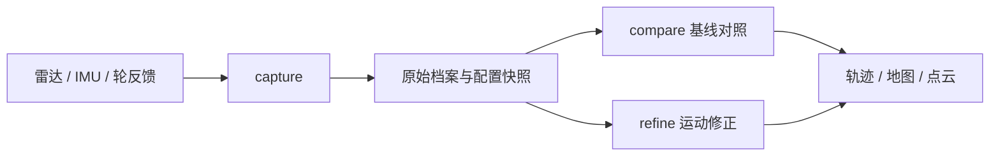

# SmartWheel · 双雷达采集与建图

SmartWheel 是面向轮椅传感器研究的 ROS 2 工程：采集双 XT-M60 雷达、H30 IMU 和轮反馈，保存完整来源，再用同一份录包反复融合、建图和比较算法。相机、超声波按采集配置选择；程序保留操作者的键盘与手推入口。

代码、配置与测试源码由 Git 管理，录包、地图、日志和实验产物保存到独立的数据目录。**普通本机目录即可使用，U 盘只是可选后端。** 发布分支 `v7/orin-usb-20261006` 沿用历史名称，不表示项目只能从 U 盘运行。

## 导航

- [运行环境](#运行环境)
- [首次部署](#首次部署)
- [配置与目录](#配置与目录)
- [采集与实时建图](#采集与实时建图)
- [离线融合与对照](#离线融合与对照)
- [查看点云与地图](#查看点云与地图)
- [验证与文档](#验证与文档)
- [完整部署指南](docs/deployment.md)
- [全部算法选项与结果](docs/algorithm_selection.md)
- [外参配置与修改](docs/calibration_configuration.md)

## 功能

- 左右雷达分别保存 raw/filtered 点云、身份、帧编号、时间和配置；IMU 保存原包，轮反馈保存请求、响应、寄存器及错误。
- 独立采集不启动 SLAM；离线融合不连接真实设备、不回放历史驾驶指令。
- 五状态 EKF 与 `robot_localization` 基线对照，以及零偏、轮速、过程噪声和几何纠偏实验。
- RTAB-Map 导出、RViz 查看、左右点云网页配准；输入、参数和结果可追溯。



雷达 raw 是设备处理和 SDK 投影后、主机过滤前的点云，不是原始 UDP。相机 BGR 归档不是原始 UVC 字节。

## 运行环境

| 项目 | 范围 |
|---|---|
| 系统 | Ubuntu 22.04，Linux aarch64 或 x86_64 |
| ROS / Python | ROS 2 Humble / Python 3.10 |
| 原生依赖 | Qt5 / RViz、Boost、Eigen、OpenSSL、RTAB-Map 0.23 系列、robot_localization、匹配 OpenCV 4.5.4 与 legacy TBB |
| 代码位置 | 任意普通本地目录，可含空格；不限定用户名和主机名 |
| 数据位置 | 默认 `~/wheelchair-data`，可选其他本机目录或外置存储 |
| 历史实机基线 | Jetson Orin、Ubuntu 22.04.5、Jetson Linux 36.4.4、RTAB-Map 0.23.7、robot_localization 3.5.4 |
| Windows | 不支持原生运行；可编辑和备份。WSL2 可作为 Linux 离线环境，硬件转发与 GUI 未验收 |

通用适配不等于所有新平台均已完成实机采集。新机器需完成构建、软件检查、离线重放及所需硬件验收。

## 首次部署

**`configure_storage` 只设置保存位置，不会安装依赖、准备 SDK、编译程序或恢复设备绑定。** 完整步骤见 [部署指南](docs/deployment.md)。

### 1. 获取程序并选数据目录

```bash
PROJECT="$HOME/projects/wheelchair"
mkdir -p "$HOME/projects"
git clone --branch v7/orin-usb-20261006 --single-branch \
  https://github.com/owenkings/smartwheel.git "$PROJECT"
cd "$PROJECT"
python3 scripts/configure_storage \
  --backend directory --archive-root "$HOME/wheelchair-data"
```

代码路径可自行更换；已有工程不要覆盖。本机存储配置写入被 Git 忽略的 `config/storage.local.json`。

### 2. 依赖、SDK 与构建

先完成 [系统 / ROS 依赖安装](docs/deployment.md#2-基础系统与依赖)。SDK 尚不存在时，在工程根执行：

```bash
(
  set -euo pipefail
  test ! -e SDKs/xtsdk_ros && test ! -L SDKs/xtsdk_ros
  mkdir -p SDKs
  git clone https://github.com/XT-Toffuture/xtsdk_ros.git SDKs/xtsdk_ros
  git -C SDKs/xtsdk_ros checkout --detach 965d31ae726c44b47ad646666c3c5fa2a4d91bf4
  PATCH_FILE="$PWD/vendor_patches/xtsdk_ros_965d31a.patch"
  git -C SDKs/xtsdk_ros apply --check "$PATCH_FILE"
  git -C SDKs/xtsdk_ros apply "$PATCH_FILE"
)
bash scripts/prepare_opencv45.sh
source "${WHEELCHAIR_ROS_SETUP:-/opt/ros/humble/setup.bash}"
python3 scripts/wc_phase1 build
source install/main/setup.bash
```

SDK 主体按固定提交恢复到工程 `SDKs/`；两种架构的固定滤波库已附在 `SDKs/xtsdk_filter_3d3db067/`。构建核验来源、补丁和 ABI，不运行厂商样例，见 [SDK 说明](vendor_patches/README.md)。

工程从入口所在位置定位根目录。特殊嵌入场景可设置绝对路径 `WHEELCHAIR_PROJECT_ROOT`；ROS 不在默认位置时设置 `WHEELCHAIR_ROS_SETUP`，指向兼容 Humble 的 `setup.bash`。

### 3. 离线使用或连接设备

离线研究只需另行带回录包，身份来自档案。真实采集前按 [设备配置](docs/deployment.md#6-连接真实设备)填写本机身份、串口 / USB 路径和雷达地址；不要使用公开示例身份连接设备。

```bash
# 只读诊断；不是每次采集都要手工执行的步骤。
python3 scripts/wc_phase1 doctor --profile mapping_core
python3 scripts/map all --check-config
```

## 配置与目录

```text
<项目目录>/src scripts config tests docs   程序、模板、维护中的测试源码
<项目目录>/SDKs build install             依赖、构建、安装
<数据目录>/data/experiments/<session>/    原始录包
<数据目录>/data/analysis/<experiment>/    融合、对照结果
<数据目录>/data/calibration/             配准候选
<数据目录>/maps/                         保存地图
<数据目录>/reports/                      日志、测试与诊断产物
```

| 文件 | 用途 |
|---|---|
| `storage.json` / `storage.local.json` | 通用存储配置 / 本机覆盖 |
| `device_bindings.json` / `device_bindings.local.json` | IMU 身份、可选网卡限制 / 本机覆盖 |
| `hardware_setup.json` | 机械关系、外参、轮参数与来源 |
| `mapping_live.json` | 模型、滤波、频率、显示与持久化选择 |
| `wheel_feedback_current.json` | 轮反馈身份及读取协议 |
| `cameras.json`、`ultrasonic_capture.json` | 可选设备角色和稳定身份 |

以上文件均在 `config/`。日常 `data/...`、`reports/...`、`maps/...` 逻辑路径映射到数据根；锁与 Unix socket 留在本机 Linux 运行位置。详见 [存储说明](docs/storage_portability.md) 和 [外参配置](docs/calibration_configuration.md)。

## 采集与实时建图

完成设备配置后，由现场操作者在图形终端录制：

```bash
SESSION="v7_core_$(date +%Y%m%d_%H%M%S)"
python3 scripts/wc_phase1 capture \
  --profile mapping_core --session "$SESSION" --duration 300 \
  --manual-drive --preview
```

`mapping_core` 录双雷达、IMU、轮反馈；`mapping_cameras` 加相机；`all_sensors` 再加超声波。`--manual-drive` 开启操作者键盘 / 手推流程，`--preview` 订阅同一数据源。`--dry-run` 是可选诊断，不实际录制。

命令默认 `--staging memory`：先录入本机 `/dev/shm`，停止后才转存到数据目录并核验。可录时长同时受可用内存和目标磁盘容量限制，`--duration 300` 是上限，不保证一定录满；触及运行中空间下限会收尾。**手动驾驶并保存到 exFAT 时，当前必须保持 memory，不能改为 `--staging disk`。** 详细限制见 [存储说明](docs/storage_portability.md#4-运行状态暂存和测试产物)。

300 秒是上限。提前结束按 **一次 Ctrl+C**，等待停源、转存和核验；`TRANSFERRING` 时不要关终端或拔盘。完成后复核：

```bash
python3 scripts/wc_phase1 doctor \
  --session-root "data/experiments/$SESSION" --verify-archive
```

实时预览与累计建图会启动设备：

```bash
python3 scripts/map all
python3 scripts/map all --mapping true --retention-profile experiment
```

`left` / `right` 是单雷达诊断，`all` 为双雷达。停止后由用户选择是否保存派生地图；研究阶段保留 `experiment` 原始档案。`map_only` 会按明确选择清理原始档案，清理后不能重放。

## 离线融合与对照

以下只读档案、不连接设备；每次输出到新目录。

```bash
SESSION=你的已录会话名
OUT_BASE="data/analysis/refined_${SESSION}_$(date +%Y%m%d_%H%M%S)"
python3 scripts/wc_phase1 refine \
  --dataset "data/experiments/$SESSION" --output "$OUT_BASE" \
  --mechanical-initial --process-noise legacy --geometry off --native-map
```

`--mechanical-initial` 明确使用已有 V7 机械初值，不改正式外参。若档案为 PARTIAL，查看原因并接受其研究限制后才追加 `--allow-partial`。零偏或轮反馈候选验证失败会说明原因，不自动以零值继续。

连续噪声实验复用**同录包、同运动候选**：

```bash
python3 scripts/wc_phase1 refine \
  --dataset "data/experiments/$SESSION" \
  --output "data/analysis/psd_${SESSION}_$(date +%Y%m%d_%H%M%S)" \
  --motion-candidate "$OUT_BASE/motion_candidate.json" \
  --mechanical-initial --process-noise white_acceleration \
  --linear-acceleration-psd 0.25 --angular-acceleration-psd 0.25 \
  --geometry off --native-map
```

PSD 单位为 m²/s³ 和 rad²/s³，与旧方差不同。`legacy` 仍为默认，几何纠偏默认关闭。

两个 EKF 的现有基线：

```bash
python3 scripts/wc_phase1 compare \
  --dataset "data/experiments/$SESSION" \
  --output "data/analysis/ekf_${SESSION}_$(date +%Y%m%d_%H%M%S)" \
  --estimators five_state robot_localization \
  --cloud raw --filter on --input-rate-hz 5 \
  --native-map --native-rate-hz 5 --mechanical-initial
```

`compare` 尚未共用 `refine` 的完整运动修正候选，不能用修正版五状态与未同样修正的官方 EKF 宣布胜负。其他入口有 `--filter off on`、`--cloud raw|filtered`、`compare --input-rate-hz 5 10 0`、`refine --geometry on`。已有单录包结果，但尚无最终算法选型及独立精度结论。

完整 **30 类状态、未实现的对照、已有结果及淘汰顺序**见 [算法选型](docs/algorithm_selection.md)。

## 查看点云与地图

```bash
EXPORT="$OUT_BASE/native/calibrated_motion/export"
python3 scripts/view_map "$EXPORT" --check
python3 scripts/view_map "$EXPORT" --max-view-points 300000
```

在 Linux 图形桌面打开 RViz。显示上限不删除已保存点；默认软件渲染，可追加 `--renderer system` 比较本机图形后端。

左右点云网页配准：

```bash
bash scripts/align_lidar_clouds.sh \
  --input reports/你的配准输入/prepared.json \
  --scene-index 0 --duration 7200 --no-browser
```

在运行机器打开 [http://127.0.0.1:8767/alignment](http://127.0.0.1:8767/alignment)。输入准备和变换含义见 [配准说明](docs/offline_cloud_alignment.md)；候选不自动覆盖正式外参。单独打开 RViz 可用 `python3 scripts/wc_phase1 rviz --view 3d --session 新会话名`，它本身不产生传感器数据。

## 验证与文档

```bash
source "${WHEELCHAIR_ROS_SETUP:-/opt/ros/humble/setup.bash}"
source install/main/setup.bash
bash tests/run_target_tests.sh \
  tests/usb_storage tests/operations/test_software_test_runner.py
```

日志、缓存与临时夹具归档到数据根 `reports/test_runs/`。需要 POSIX 的夹具在本机临时目录运行。不要无差别执行现场硬件脚本。

| 问题 | 检查方向 |
|---|---|
| 存储已配置但程序不能运行 | ROS / SDK / ABI、完整构建与安装环境 |
| 身份不匹配 | 本机绑定、真实枚举与左右角色，保留身份检查 |
| 点云已录但不可见 | 来源计数、坐标系、预览日志、图形后端 |
| 文件可读但墙面弯曲 | 单帧、时间、运动、几何对照；可读不等于精度通过 |

2026-10-07 移植回归：在 Orin 的独立、含空格工程路径运行软件检查；修正并定向复测后，1,241 个不同用例的最新结果均通过。Qt 的 4 项原生测试、雷达驱动的 12 项原生测试通过；已有真实录包的只读加载、设备身份及来源哈希核对通过。这不是在空白系统上的全新安装验收，也不是 x86_64 原生构建或现场驾驶验收。

构建、合成测试、真实录包、静态采集、用户驾驶及几何精度分别验收。历史 Orin 结果不能自动证明新电脑、新装配已经通过。

- [完整部署与重置恢复](docs/deployment.md)
- [全部算法选项与实验](docs/algorithm_selection.md)
- [外参配置、已保存测量与修改校验](docs/calibration_configuration.md)
- [存储目录、换机与可选外置盘](docs/storage_portability.md)
- [录制档案契约](docs/v7_complete_recording.md)
- [V7 操作参考](docs/v7_operations.md)
- [SDK 版本、过滤库与补丁](vendor_patches/README.md)
- [公开发布范围](PUBLICATION.md)

保留各包已有许可和第三方来源声明。仓库不附带原始录包、室内地图与本机覆盖配置；过滤二进制来源和许可边界见其 NOTICE。
