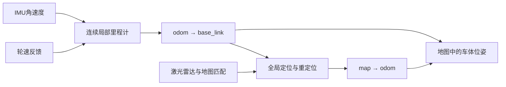

# 定位、朝向与障碍感知

本项目目前提供传感器采集、预览、标定、建图和离线处理。建图输出与诊断位姿不能直接视为已验收的自动导航系统；当前建图先验仍声明 `navigation_enabled=false`。本文说明现有数据的用途及后续接入边界，不启用车辆运动或改变现有算法参数。

## 四路测距模块与激光雷达

现有地址 1、2、3、4 对应 RS485 超声波测距模块，资料型号为 FD07-34R，并非毫米波雷达。通信使用 9600 baud、8N1、Modbus FC03；读取寄存器 `0x0001`，数量 1。型号与寄存器定义依据 FD07-34R 模块手册；正式采集与原始记录实现见 [ultrasonic_capture.py](../../src/wc_runtime/ultrasonic_capture.py)。不要用写寄存器指令试探设备。

通信响应、距离准确性和空间标定分别验收。四路能返回合法 CRC，仅证明地址与通信链路可用；还需用已知距离的目标检查单位、盲区、无回波和超量程编码、材质/角度影响，并排查多探头串扰。寄存器按手册解释为毫米，但正式采集仍保留原始值及未知状态；未完成验证前不把未知值解释为零距离或无限远。

建议激光雷达承担环境几何、建图、定位和局部障碍轮廓的主要感知；超声波补充经实测确认的近距离覆盖区域。补充范围取决于探头高度、波束、朝向和实物遮挡，不能仅凭模块数量声称已覆盖全部盲区。两类传感器的融合对象是车体附近的障碍区域与可信度，不是把两个距离直接取平均。有效的近障碍观测不能被另一传感器的远距离或缺失回波抵消。

超声波输出是一束范围内的测距，不是一个精确三维点。四个地址须分别绑定实物位置、安装原点、朝向、波束角和有效量程，并标定到车体坐标系。完成这些工作后，可发布带独立 `frame_id`、实际测量时间和有效范围的 `sensor_msgs/Range`，采用扇区范围模型接入局部代价地图。ROS [Range 消息定义](https://github.com/ros2/common_interfaces/blob/humble/sensor_msgs/msg/Range.msg)明确区分超声波与红外并描述视场；Nav2 的 [RangeSensorLayer](https://github.com/ros-navigation/navigation2/blob/main/nav2_costmap_2d/plugins/range_sensor_layer.cpp)提供相应范围模型。项目当前未接入该导航层。

轮询周期会限制可用速度。一次四地址完整更新的时间包含串口响应、间隔和超时，不等于单次响应时间。未来的减速/停止距离至少要覆盖 `速度 × 总延迟 + 速度² / (2 × 保守制动减速度) + 不确定性余量`，总延迟包括最坏数据年龄、传输、处理、控制和执行延迟。需要在实车负载、地面和速度下测定制动能力，不能从通信测试推导安全速度。失联、过期或无效数据应显式报告未知；涉及行驶方向的关键感知或定位失效时，后续控制层必须进入已验证的减速/停止策略。

当前几何依赖见 [geometry.md](../reference/geometry.md)：`ultrasonic_spatial_projection` 尚要求地址与物理角色、原点、轴和波束绑定。不得填入猜测的外参绕过检查。

## 路径规划需要地图位姿

室内路径规划首先需要轮椅在同一张地图中的 `(x, y, yaw)` 及其时间和不确定性。`yaw` 是车头相对地图轴的朝向；地图可以沿走廊建立，不要求先知道东西南北。ROS [REP-105](https://github.com/ros-infrastructure/rep/blob/master/rep-0105.rst)也允许室内地图按建筑布局定向。

建议按以下职责建立定位链路：

- **局部里程计**：融合轮速反馈和经过轴向、零偏、时间核验的 IMU 角速度，提供平滑的 `odom → base_link`。轮速会受打滑和轮参数误差影响，陀螺积分会漂移；融合不能自动消除这些误差。官方 [Nav2 的 robot_localization 接入示例](https://github.com/ros-navigation/docs.nav2.org/blob/rolling/docs/configuration_and_development/first_time_robot_setup_guide/odom/setup_robot_localization.md)展示了这种接口。
- **地图定位**：建图期间用激光匹配及闭环修正长期漂移；已有地图导航时采用经过验证的地图定位，例如二维地图的 AMCL 或匹配现有三维建图器的定位模式，输出 `map → odom`。重启、被搬动或失去定位后，要完成初始位姿确认或可靠重定位再允许自动行驶。
- **车体基准**：建立明确的 `base_link`，校验车头正向、轮轴位置、轮距/轮径、激光雷达及 IMU 到车体的外参。当前 `mapping_reference`、`prior_odom`、`mapping_odom`、`mapping_map` 是建图链路的坐标系，不能仅重命名便声称完成车体定位。尤其不能把雷达自身的 yaw 直接当成车头 yaw。
- **规划与控制**：在已验证的可通行地图、轮椅真实外形和动态障碍代价地图上规划；控制使用连续局部位姿，并监控定位质量、数据年龄和执行反馈。现有投影栅格尚未验收为导航地图。定位置信度不足、TF 不完整或关键输入过期时，不继续盲目执行路径。

各变换必须只有一个明确发布者，并保持 `map → odom → base_link → sensors` 的关系。地图校正可以改变全局估计，局部里程计保持连续；这两个职责不应混在一个会跳变的控制位姿中。工程坐标方向遵循 [REP-103](https://github.com/ros-infrastructure/rep/blob/master/rep-0103.rst)：车体 x 前、y 左、z 上，旋转为右手规则。

## IMU yaw 与东西南北

IMU 角速度适合提供短时转向变化；仅积分不能长期保持绝对航向，也不能单独提供可靠位置。四元数中有 yaw，不意味着设备正在输出磁北或真北参考。静止重力可以约束俯仰和横滚，不能确定水平 yaw。

若界面需要指南针，应单独核验设备当前运行模式、实际输出字段、安装偏角、磁校准、车体电机和钢结构的磁干扰，以及磁北到真北的磁偏角，并使用独立方向参照验证。ENU 中 yaw=0 指东是坐标约定，不是传感器已经测到东。官方 [robot_localization 航向约定](https://github.com/cra-ros-pkg/robot_localization/blob/rolling-devel/doc/navsat_transform_node.rst)也要求区分 yaw 偏置和磁偏角。

需要与地理坐标关联的室外任务可再考虑 GNSS、双天线航向或经验证的磁航向；室内地图导航无需为获取东西南北而强制引入它们。当前不把尚未现场验收的绝对航向加入生产融合，也不修改 IMU 工作模式。

## 验证与新增内容

新增驱动放入 [wc_sensors](../../src/wc_sensors/README.md) 或对应传感器包；正式运行编排放入 [wc_runtime](../../src/wc_runtime/README.md)；导航功能应有独立职责的源码包与 README，不把实现放入测试目录。配置按 [config](../../config/README.md) 的模板/本机覆盖规则管理，实际设备身份不写入公开文档。

测试依次覆盖协议与异常输入、冻结录包回放、真实静止标定、受控低速动态验证。通信成功不能代替障碍检测验收；软件回放不能代替制动验证。验证报告和原始事务进入数据根的开发归档，工程说明只记录接口、规则和当前能力边界。返回[系统设计](README.md)或[项目入口](../../README.md)。
